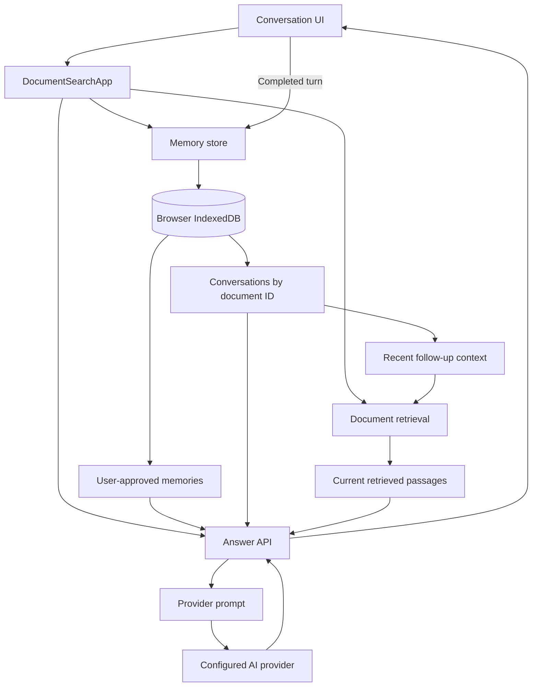
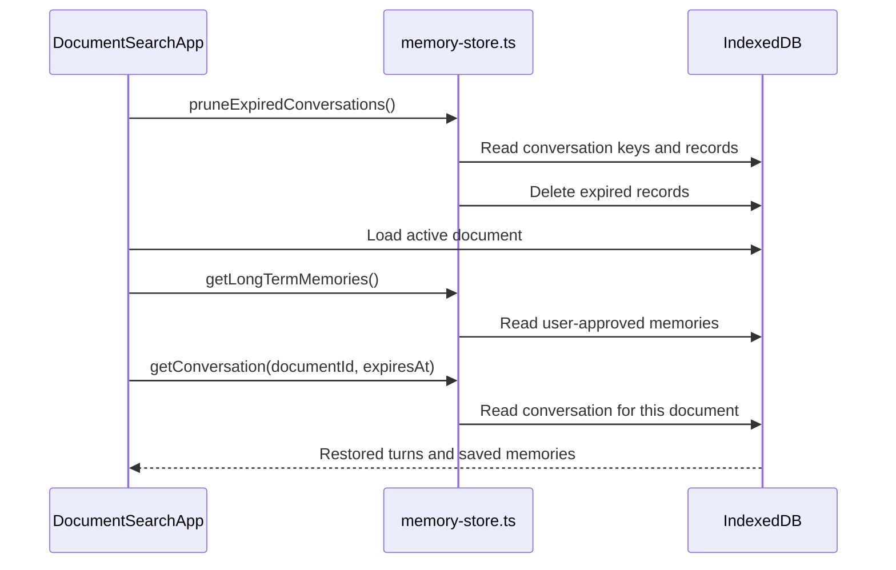
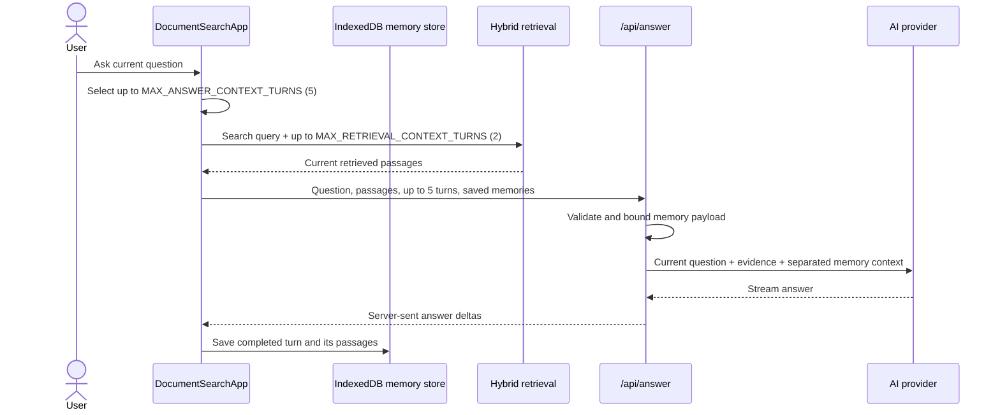
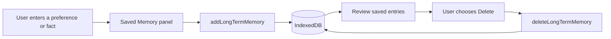
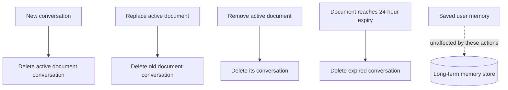

# 05 - Conversation History and User Memory

## Why this improvement was needed

The conversation-first interface made turns visible, but visible turns alone do not give the application memory. Each question was still largely treated as an independent search. That makes follow-ups such as "What about the second option?" difficult because the application may not know what "the second option" refers to.

The project now keeps two different kinds of memory:

1. **Short-term conversation history**: recent questions and answers associated with the active document.
2. **Long-term user memory**: preferences or facts the user explicitly chooses to save.

They have different lifetimes, permissions, and jobs, so they are stored and passed to the model separately.

## Memory architecture



IndexedDB is accessed through one database definition. The `documents`, `conversations`, and `long-term-memories` object stores are created by `lib/app-db.ts`.

## What each memory is for

| Memory | Stored data | Lifetime | Used for |
| --- | --- | --- | --- |
| Short-term conversation | Completed question, answer, mode, and retrieved passage metadata/text | Per active document; expires with the document after 24 hours | Resolve follow-up references and retain the visible transcript |
| Long-term user memory | User-entered preference or fact, ID, creation time | In this browser until the user deletes it | Personalize style or answer a question explicitly about the user |

The application does not automatically extract long-term memories from model responses. Uploaded document chunks and their embeddings remain document data, not conversation memory.

## Startup and restore flow



The conversation is keyed by the active document ID, so a conversation for one document is not attached to a replacement document. Expiration is checked against both the stored conversation expiry and the active document expiry.

## Question and answer data flow



### 1. Select history

Before retrieval, the UI selects up to `MAX_ANSWER_CONTEXT_TURNS` (currently 5) completed turns, excluding `quick` / Find Sources turns. Those source-only turns remain visible in the transcript, but their status text (for example, "3 relevant passages found") is not a user answer and should not steer later searches.

Only the latest `MAX_RETRIEVAL_CONTEXT_TURNS` (currently 2) selected turns are added to the retrieval query, with the current question clearly marked. This gives retrieval a small amount of follow-up context without embedding the entire conversation on every search.

Both limits are defined in `lib/memory-limits.ts`, so the UI and answer API use the same named values.

### 2. Retrieve current evidence

The context-enriched query is embedded and used by the existing hybrid retriever. The resulting passages are the current evidence for claims about the uploaded document. Prior answers and saved user memories do not replace retrieval.

### 3. Call the answer API

For answer-producing modes, the UI sends:

```json
{
  "question": "What about the second option?",
  "sources": ["current retrieved passages"],
  "mode": "agent",
  "conversationHistory": [
    { "question": "Which options are available?", "answer": "..." }
  ],
  "longTermMemories": ["I prefer concise answers"]
}
```

This illustrates the payload shape; `sources` contains structured retrieved-source objects in the actual request.

The API accepts at most five history turns, truncates each question and answer, and accepts at most 30 saved memories with a per-entry length bound. It then passes these to `streamingAnswer` as separate parameters.

### 4. Keep context roles separate

The provider prompt has separate sections for:

- **Current sources**: evidence for uploaded-document claims.
- **Recent conversation**: context for resolving follow-up references, not evidence for document claims.
- **User-approved saved memory**: personalization and questions explicitly about the user, not evidence about the uploaded document.

This separation matters. If a prior model answer or a saved preference is treated as document evidence, an unsupported claim can be repeated as if it came from the uploaded file.

### 5. Save completed turns

When the response finishes, the UI saves the turn with its retrieved passages. `saveConversation`:

- retains only completed turns;
- keeps the latest ten turns;
- stores passage text and citation/score metadata;
- omits passage embeddings, which are already stored with the active document.

The limit also applies to the visible in-memory transcript.

## User-approved long-term memory flow



Saved entries are stored locally in this browser until deleted. At question time, the UI sends them to the answer API, which includes the latest 30 in the request passed to the configured AI provider. The Saved Memory panel discloses that provider use. Do not save secrets or information the user did not mean to retain.

## Clearing and expiration



New Conversation, document replacement/removal, and expiry clear short-term conversation history. They do not clear long-term saved memories. A saved memory is removed only through its Delete action.

## Where the flow lives in code

| Responsibility | Implementation |
| --- | --- |
| IndexedDB schema and upgrade | `lib/app-db.ts` |
| Active-document persistence | `lib/document-store.ts` |
| Conversation and saved-memory persistence | `lib/memory-store.ts` |
| Shared conversation and memory types | `lib/conversation-types.ts` |
| Restore state, select context, retrieve, persist turns | `components/document-search-app.tsx` |
| Add/review/delete long-term memories | `components/memory-panel.tsx` |
| Validate API memory payload and select answer task | `app/api/answer/route.ts` |
| Keep evidence, history, and saved-memory prompt sections distinct | `lib/ai-provider.ts` |

## Learning takeaways

- A visible transcript becomes short-term memory only when the application persists and reuses it.
- More context is not automatically better. The application bounds the history used by retrieval and generation.
- Source-only UI status is not a conversational answer and is excluded from model context.
- Conversation history can resolve references, but current retrieved passages remain the evidence for document claims.
- Long-term memory should be intentional, inspectable, and deletable; this MVP does not infer it automatically.
- Browser storage is local to the browser profile, not account synchronization or server-side storage.